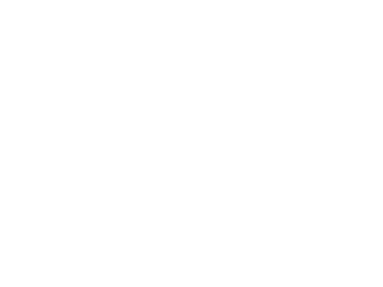
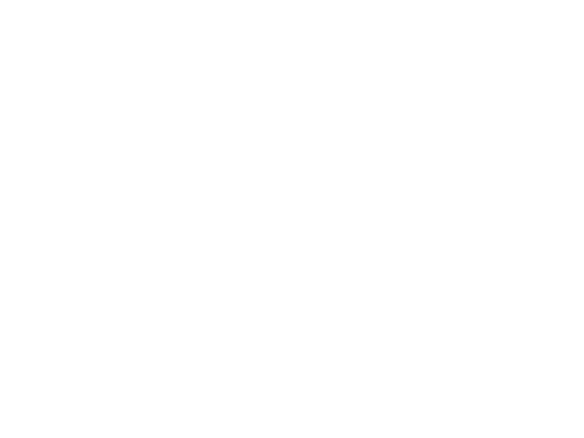
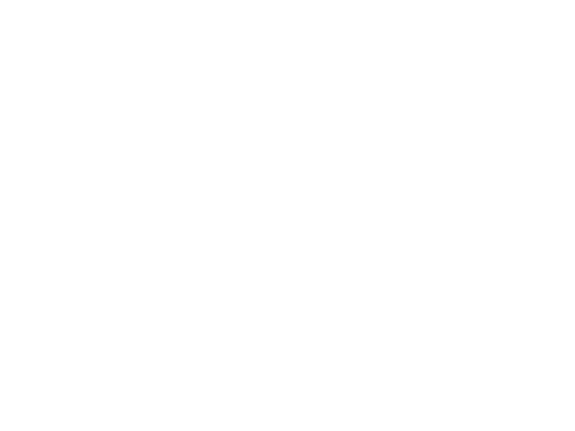



# Introducción

## Contexto y Relevancia del problema

## Brecha en la literatura

## Preguntas de investigación

En respuesta a los vacíos identificados, este trabajo formula dos preguntas de investigación principales:
1. ¿Cuál modelo de la familia GARCH, entre ARCH, GARCH, EGARCH, GJR-GARCH y APARCH, ofrece el mejor desempeño predictivo para la volatilidad del DJIA durante el periodo 2000-2025, consierando tanto criterios de ajuste in-sample como métricas de precisión out-of-sample bajo diferentes esquemas de estimación?
2. ¿En qué medida las mejoras estadísticas, en el pronóstico de la volatilidad, generan valor económico real medido a través de la precisión en pricing de opciones financieras?

## Objetivos
El primer objetivo general responde a la dimensión estadística, mientras que el segundo objetivo general corresponde a la dimensión económica. Cada uno se desglosa en tres objetivos específicos que establecen una progresión lógica desde la estimación hacia la evaluación y de lo estadístico hacia lo económico.

1. Objetivo General 1: Comparar el desempeño predictivo de distintos modelos de la familia GARCH en la estimación y pronóstico de la volatilidad condicional del Dow Jones Industrial Average, evaluando su robustez estadística y estabilidad bajo diferentes condiciones de mercado.
    * Objetivo Específico 1: Implementar y estimar diferentes especificaciones de la familia GARCH utilizando datos diarios de retornos.
    * Objetivo Específico 2: Evaluar el desempeño out-of-sample de los modelos mediante métricas de pérdida apropiadas para pronósitcos de volatilidad y pruebas formales de comparación de modeos.
    * Objetivo Específico 3: Analizar la estabilidad y consistencia del desempeño predictivo de los modelos a nivel individual y agregado bajo distintos regímenes de mercado.
2. Objetivo General 2: Determinar si el uso de volatilidad pronosticada mediante modelos GARCH genera valor económico medible en aplicaciones financieras de pricing de opciones.
    * Objetivo Específico 1: Incorporar la volatilidad pronosticada en esquemas de evaluación Black-Scholes para generar precios teóricos de opciones.
    * Objetivo Específico 2: Comparar los errores de valuación frente a alternativas basadas en volatilidad histórica e implícita.
    * Objetivo Específico 3: Evaluar el impacto sobre métricas de cobertura.

## Contribución del Estudio

## Estructura del documento

# Revisión Literaria

## Hechos estilizados de la volatilidad financiera

La justificación empírica para modelar dinámicamente la volatilidad financiera surge de una regularidad principal, siendo esta que aunque los rendimientos de los activos suelen mostrar baja dependencia lineal, su variabilidad no se comporta como ruido blanco. La evidencia de @mandelbrot1963variation y @fama1965behavior cuestiona directamente el supuesto gaussiano clásico al documentar que las variaciones de precios presentan distribuciones con gran concentración en el centro y colas más pesadas que las implicadas por la normalidad.

@mandelbrot1963variation plantea que los precios de mercado exhiben desviaciones extremas con una frecuencia mayor a la esperada bajo un proceso browniano tradicional, proponiendo distribuciones estables paretianas como alternativa para capturar dicha evidencia empírica. @fama1965behavior, por su parte, reconoce que las distribuciones de cambios en precios presentan leptocurtosis, es decir, demasiadas observaciones alrededor de la media y demasiadas observaciones en las colas, lo que hace insuficiente el supuesto de normalidad como descripción estadística de los retornos financieros.

Un segundo hecho estilizado, posterior a la evidencia de colas pesadas y leptocurtosis es el *volatility clustering*. La evidencia reportada por @mandelbrot1963variation y @fama1965behavior muestra que los movimientos grandes tienden a ser seguidos por movimientos grandes, y los movimientos pequeños por movimientos pequeños, aún cuando el signo de dichos movimientos sea difícil de predecir. Esta regularidad implica que el nivel de riesgo observado hoy afecta la expectativa de riesgo futuro. @engle2001good formalizan esta intuición al señalar que un buen modelo de volatilidad debe capturar persistencia, reversión a la media y asimetría, ya que la función práctica de estos modelos no es únicamente describir la varianza histórica, sino pronosticar la volatilidad relevante para la gestión de riesgo, valuación de derivados, cobertura, asignación de portafolios y *market making*.

@cont2001empirical consolida estos hallazgos en una taxonomía de hechos estilizados observables en distintos mercados, activos y frecuencias. Entre los más relevantes para la modelación dinámica de la volatilidad destacan *heavy tails*, *volatility clustering*, *conditional heavy tails*, *slow decay of autocorrelation in absolute returns* y el *leverage effect*. La principal aportación de Cont no es únicamente identificar estas propiedades sino, mostrar que son suficientemente robustas como para considerarse regularidades empíricas que cualquier modelo de volatilidad debe tomar en cuenta.

La literatura ARCH/GARCH surge como una respuesta a esta necesidad de modelar una varianza condicional dinámica. @bollerslev1992arch señalan que, aunque el *volatility clustering* ya era una regularidad empírica conocida en precios especulativos de alta frecuencia, la modelación explícita de la varianza condicional se volvió central con el desarrollo de los modelos ARCH y sus extensiones. Estos modelos permiten que la varianza esperada dependa de la información pasada, capturando la idea de que los choques recientes afectan el riesgo futuro.

Además de persistente, la volatilidad financiera exhibe reversión a la media. @engle2001good argumentan que el *volatility clustering* implica que la volatilidad aparece en episodios, pero dichos episodios no son permanentes, los periodos de alta volatilidad eventualmente ceden hacia niveles más normales, y periodos de baja volatilidad tienden a revertir hacia niveles superiores. Esta propiedad es relevante para el diseño de modelos, ya que un buen modelo debe permitir que los choques tengan efectos duraderos más no infinitos sobre la varianza esperada.

Finalmente, la evidencia empírica muestra que la respuesta de la volatilidad no es simétrica. @christie1982stochastic documenta una relación negativa entre el valor del equity y la volatilidad de los retornos accionarios. Esto se explica por el apalancamiento financiero, cuando cae el precio de la acción, aumenta el ratio deuda-capital y con ello la volatilidad del rendimiento para los accionistas. Este mecanismo es la base del *leverage effect*, que explica cómo choques negativos elevan la volatilidad futura más que los choques positivos de magnitud equivalente. @engle2001good refuerzan este punto al señalar que, para retornos accionarios es poco realista asumir que innovaciones positivas y negativas tengan el mismo impacto sobre la volatilidad y que este fenómeno se ve reflejado en las distribuciones de precios pronosticados y la forma de la superficie de volatilidad implícita de opciones.

En conjunto, estos hechos estilizados constituyen el fundamento empírico para modelar la volatilidad de forma dinámica. Las colas pesadas y la leptocurtosis invalidan la normalidad como supuesto base; el *volatility clustering* revela dependencia temporal en la varianza; la persistencia y la reversión a la media exigen modelos capaces de transmitir choques al futuro sin hacerlos permanentes y el *leverage effect* obliga a distinguir entre el signo y la magnitud de las innovaciones.

## Modelos simétricos: ARCH y GARCH

Bajo este marco, la pregunta ya no es si la volatilidad es dinámica, sino cómo parametrizar esa dinámica de forma consistente con la evidencia empírica. Para ello, @engle1982autoregressive introduce el modelo *Autoregressive Conditional Heteroskedasticity* (ARCH), cuya premisa central es que la varianza condicional en el período $t$ depende de los cuadrados de los errores pasados, reproduciendo el *clustering* de volatilidad documentado por @mandelbrot1963variation y @fama1965behavior. Sin embargo, suele presentar problemas de parsimonía en muestras finitas ya que para capturar la persistencia de la volatilidad observada se requiere un número elevado de rezagos. @bollerslev1986generalized aborda este problema al proponer el *Generalized ARCH* (GARCH), que incorpora rezagos de la propia varianza condicional, logrando capturar esa misma persistencia con tan solo tres parámetros que captan el nivel, la reacción a los choques y la persistencia: $\omega$ (omega), $\alpha$ (alpha) y $\beta$ (beta).

La solidez empírica del GARCH(1,1) como especificación de referencia está respaldada por la literatura de los últimos años, @hansen2005forecast comparan 330 modelos de la familia ARCH en su *survey*, y concluyen que es notablemente difícil de superar cuando el criterio de evaluación es estadístico. Por ello, se incluye como benchmark natural en la comparación de este estudio.

No obstante, tanto el ARCH como el GARCH comparten una limitación estructural fundamental: su especificación es simétrica. En ambos modelos, el impacto de un choque sobre la varianza condicional depende únicamente de su magnitud y no de su dirección, de modo que, un choque negativo y uno positivo de igual magnitud generan exactamente el mismo incremento en la volatilidad condicional. Esta limitante es insostenible en los mercados de renta variable; ya que como @christie1982stochastic documenta, los choques negativos generan incrementos de volatilidad sistemáticamente mayores que los positivos de igual magnitud.

## Modelos asimétricos: EGARCH, GJR-GARCH y APARCH

Superar la limitante de simetría exige modelos que distingan entre el signo y la magnitud de los choques, y la literatura ofrece tres respuestas estructuralmente distintas.

@nelson1991conditional propone el modelo *Exponential GARCH* (EGARCH) con dos innovaciones estructurales. Primero, modelar el logaritmo de la varianza condicional en lugar de la varianza directamente, eliminando la necesidad de imponer restricciones de no negatividad sobre los parámetros. Segundo, incorporar tanto la magnitud como el signo de los choques pasados en la ecuación de la varianza condicional, permitiendo que choques negativos y positivos de igual tamaño tengan efectos diferenciados sobre la volatilidad futura.

@glosten1993relation proponen una alternativa más parsimoniosa, la cual es que el modelo GJR-GARCH extiende la especificación del GARCH estándar incorporando una variable indicadora que activa un término adicional en la ecuación de la varianza condicional únicamente cuando el choque del período anterior es negativo. @engle1993measuring demuestran que el GJR-GARCH captura mejor la respuesta asimétrica de la volatilidad ante noticias negativas frente a noticias positivas, lo que explica su amplia adopción en la literatura empírica.

La especificación más flexible de las tres es el modelo *Asymmetric Power ARCH* (APARCH), introducido por @ding1993long. El modelo APARCH generaliza simultáneamente el tratamiento de la asimetría y la potencia sobre la cual se mide la varianza condicional ya que, en lugar de modelar la varianza condicional directamente, modela una potencia flexible $\delta$ de la desviación estándar condicional, donde $\delta$ es un parámetro adicional estimado a partir de los datos. @fernandez1998bayesian complementan esta especificación al formalizar la distribución *Skewed Student-t* utilizada en la estimación del modelo APARCH, demostrando que es necesario capturar asimetría en la distribución de los errores además de la asimetría en la ecuación de varianza. Por su parte, @hansen1994autoregressive desarrolla un marco más general de estimación de densidades condicionales que permite que los parámetros de forma de la distribución varíen en función de la información disponible en cada período. Su propuesta de una distribución *Student-t* sesgada con parámetros dinámicos ofrece una alternativa que captura simultáneamente la no normalidad y la asimetría temporal de los errores, siendo metodológicamente compatible con las especificaciones APARCH estimadas en dicho estudio.

Posteriormente, @christoffersen2006option validan la relevancia de este enfoque al demostrar que capturar asimetría distribucional mejora el pricing de opciones más allá de lo que captura el efecto leverage en la ecuación de varianza, conectando directamente las propiedades del APARCH con el objetivo económico de esta investigación.

## Evaluación estadística: in-sample y out-of-sample

Determinar cuál de estos modelos produce los pronósticos más precisos exige separar el ajuste sobre los datos de estimación y la capacidad predictiva sobre datos no vistos. En su revisión de más de noventa y tres estudios sobre pronóstico de volatilidad, @poon2003forecasting documentan que la superioridad de un modelo en ajuste *in-sample* no constituye evidencia suficiente de su superioridad predictiva fuera de muestra. Este resultado tiene la consecuencia metodológica de que un modelo más complejo como el APARCH puede superar al GARCH(1,1) en criterios AIC y BIC sobre los datos de entrenamiento y, no obstante, generar pronósticos *out-of-sample* inferiores debido a sobreajuste.

La evaluación *in-sample* se realiza a través de criterios de información que penalizan la complejidad del modelo. @akaike1974new introduce el AIC, que balancea ajuste y parsimonia penalizando por el número de parámetros estimados. Por otro lado, @schwarz1978estimating propone el BIC con una penalización más severa, siendo más conservador en la selección de modelos complejos. Ambos criterios son complementarios puesto que el AIC favorece modelos con mayor poder predictivo, mientras el BIC favorece la parsimonia.

@patton2011volatility demuestra que dado que la volatilidad no es observable y debe ser calculada mediante un proxy con error de medición, la elección de la métrica de evaluación *out-of-sample* debe ser una función de pérdida que preserve el ranking entre modelos independientemente del proxy utilizado, ya que éstas producen rankings estadísticamente válidos. QLIKE satisface este criterio, mientras que el RMSE no lo satisface. Por ello, el QLIKE se adopta como métrica de evaluación estadística en este estudio.

Sin embargo, es importante distinguir que la limitación del RMSE identificada por @patton2011volatility aplica exclusivamente en la evaluación estadística *out-of-sample* con proxy imperfecto de volatilidad. Bajo este contexto, @hansen2005forecast corroboran que el uso de métricas como el RMSE puede producir rankings inconsistentes entre modelos de volatilidad no observable.

Por otra parte, la evaluación de modelos GARCH en el contexto de pricing de opciones no debe limitarse al desempeño estadístico de la predicción de volatilidad. @christoffersen2004importance muestran que los modelos favorecidos por criterios basados en retornos o *likelihood* no necesariamente son los que mejor funcionan cuando se evalúan en pricing de opciones, es decir, un modelo puede minimizar el error de predicción de volatilidad y, aun así, no minimizar el error de pricing. Esta conclusión es relevante para esta investigación ya que comparar modelos GARCH sólo con métricas estadísticas de volatilidad captura una dimensión incompleta del problema. Para resolver esto, y considerando que el precio de mercado es directamente observable, el uso de métricas de error como el RMSE, MAE y MAPE son válidas y apropiadas para comparar el desempeño de los modelos en esta dimensión específica.

## Esquemas de estimación: ventana fija y ventana móvil

La evaluación *out-of-sample* no solo exige determinar qué especificación produce el menor error de pronóstico, sino también bajo qué esquema se actualizan los parámetros que generan esos pronósticos.

@stock1996evidence proveen la justificación empírica para no asumir estabilidad paramétrica de manera automática. En su análisis de 76 series macroeconómicas y 5,700 relaciones bivariadas, documentan que la inestabilidad estructural aparece en una fracción significativa de las relaciones estimadas y comparan modelos con distintos grados de adaptabilidad, desde especificaciones de parámetros *fixed* hasta *rolling regressions* y modelos con parámetros cambiantes. Aunque su aplicación es macroeconómica, la implicación metodológica es directamente relevante para el pronóstico de volatilidad puesto que si la relación estimada cambia en el tiempo, la forma en que un modelo conserva o actualiza información histórica puede alterar su desempeño fuera de muestra.

La ventana fija representa el esquema que privilegia estabilidad paramétrica. Bajo este enfoque, el modelo conserva una base histórica amplia para estimar sus parámetros, lo que puede reducir la variabilidad de las estimaciones y evitar que movimientos recientes, potencialmente transitorios, dominen la dinámica del modelo. Sin embargo, @stock1996evidence muestran que los modelos de parámetros fijos pueden ser vulnerables cuando las relaciones presentan inestabilidad, ya que el supuesto de continuidad histórica puede dejar de ser válido en presencia de cambios estructurales. En ese contexto, una ventana fija puede conservar observaciones que ya no representan adecuadamente el régimen vigente de la serie.

No obstante, @pesaran2007selection advierten que descartar información previa al quiebre tampoco es necesariamente óptimo. Su aportación central consiste en demostrar que, aun cuando existe un cambio estructural, puede ser conveniente utilizar datos anteriores al quiebre para estimar modelos de pronóstico. El argumento es que la información pasada puede introducir sesgo si los parámetros cambiaron, pero también puede reducir la varianza del error de pronóstico al ampliar la muestra de estimación. Por ello, la selección de ventana debe entenderse como un *trade-off* entre sesgo y varianza, donde una muestra demasiado amplia puede incorporar información de regímenes obsoletos, mientras que una muestra demasiado corta puede generar estimaciones más ruidosas.

La ventana móvil surge como una alternativa frente a esa tensión. @inoue2017rolling señalan que, ante evidencia de inestabilidad paramétrica, es común estimar los modelos utilizando únicamente observaciones recientes mediante *rolling estimation*. Bajo este esquema, el modelo se re-estima conforme avanza el tiempo, incorporando nueva información y excluyendo observaciones antiguas. Sin embargo, los autores también muestran que el desempeño predictivo puede ser sensible al tamaño de la ventana, por lo que el problema no consiste únicamente en elegir entre *fixed* y *rolling*, sino en reconocer que la cantidad de información utilizada puede alterar el ranking de los modelos fuera de muestra.

Esta discusión adquiere mayor relevancia en modelos GARCH porque la persistencia estimada de la volatilidad puede confundirse con cambios de régimen. @marcucci2005forecasting señala que una preocupación recurrente en estos modelos es la persistencia excesiva de los choques, la cual puede producir pronósticos demasiado suaves o elevados entre periodos con distintos niveles de turbulencia. Además, retoma la evidencia de que cambios en la varianza incondicional pueden distorsionar los parámetros GARCH, haciendo que el modelo interprete como persistencia lo que en realidad proviene de quiebres estructurales. Bajo esta lógica, una muestra larga puede mezclar periodos de baja y alta volatilidad dentro de una misma estimación, mientras que una ventana móvil puede responder con mayor rapidez a cambios recientes en la dinámica de la serie.

En el horizonte 2000-2025, la comparación entre ambos esquemas resulta especialmente pertinente por la presencia de episodios como la crisis *dot-com*, la crisis financiera global de 2008, el COVID-19 y el periodo de ajuste posterior a la pandemia. Estos eventos pudieron modificar no solo el nivel de volatilidad, sino también su persistencia y su respuesta ante choques extremos. Por ello, comparar *fixed window* y *rolling window* permite evaluar si los pronósticos de volatilidad se benefician más de parámetros estimados con una base histórica amplia o de parámetros actualizados con mayor sensibilidad a cambios recientes. Debido a lo anterior, la comparación entre ambos esquemas forma parte de la contribución del estudio y no únicamente de su implementación metodológica.

## De la precisión estadística al valor económico

La conexión entre los modelos de volatilidad condicional y la valuación de opciones surge directamente de una limitación del modelo de Black-Scholes, siendo esta que la volatilidad entra como un parámetro que se asume constante durante la vida de la opción. En el planteamiento original de @black1973pricing, el precio del subyacente sigue un proceso continuo con varianza proporcional al cuadrado del precio, lo que implica que la tasa de varianza del rendimiento del activo se mantiene constante. Esta hipótesis permite derivar una fórmula cerrada bajo condiciones ideales de mercado, pero también impone una simplificación sobre el comportamiento real de los retornos.

@hull1987pricing muestran que, cuando la volatilidad es estocástica e independiente del precio del activo, el precio correcto de la opción puede interpretarse como el valor esperado del precio Black-Scholes integrado sobre la distribución de la varianza promedio durante la vida del contrato. Además, analizan procedimientos numéricos y simulaciones Monte Carlo para aproximar el valor de la opción cuando no existe una solución simple. Su resultado también matiza los sesgos de Black-Scholes, esto es que el modelo tiende a sobrevaluar opciones *at-the-money* y a subvaluar opciones suficientemente *deep in-the-money* o *deep out-of-the-money*, con efectos que dependen del tiempo al vencimiento. Aunque Hull & White no estiman modelos GARCH, su contribución respalda la idea de que la volatilidad relevante para una opción debe vincularse al comportamiento esperado de la varianza durante la vida del contrato.

Complementariamente, @brooks2003volatility formalizan la construcción de pronósticos de volatilidad para horizontes de varios días, su propuesta consiste en generar pronósticos de varianza condicional para cada periodo futuro y agregarlos mediante la suma de dichas varianzas, ya que la varianza es aditiva en el tiempo. Este resultado es relevante para la valuación de opciones porque el parámetro de volatilidad no debe representar únicamente el riesgo del siguiente día, sino la incertidumbre esperada durante el horizonte completo del contrato. Por ello, el uso de varianza acumulada permite construir un input de volatilidad consistente con el vencimiento de la opción y evita extrapolar mecánicamente un pronóstico de un día hacia horizontes más largos.

Desde esta perspectiva, la incorporación de volatilidad pronosticada mediante modelos GARCH puede interpretarse como una adaptación empírica del marco Black-Scholes. Esta adaptación metodológica se presenta en dos enfoques distintos, el enfoque *plug-in* y los modelos formales de *option pricing* bajo GARCH. En lugar de asumir una volatilidad constante o utilizar una estimación histórica fija, el enfoque *plug-in* sustituye ese parámetro por una predicción de varianza condicional generada por un modelo GARCH. En los modelos formales, en cambio, la dinámica de la varianza forma parte del modelo de valuación bajo una medida de pricing o medida neutral al riesgo, como ocurre en @duan1995garch, quien formaliza el pricing de opciones cuando los retornos del subyacente siguen un proceso GARCH mediante la *locally risk-neutral valuation relationship*. Esta medida permite valuar el derivado descontando sus pagos esperados a la tasa libre de riesgo. El presente estudio se ubica en el primer enfoque, donde se estiman modelos de la familia GARCH con datos históricos de retornos, se generan predicciones de varianza y dichas predicciones se usan como insumo para calcular precios de opciones mediante Black-Scholes.

Esta lógica es consistente con @bi2014study, quienes proponen utilizar GARCH(1,1) para obtener una medida de volatilidad que posteriormente se introduce en el modelo Black-Scholes. Su contribución es útil porque muestra una implementación parsimoniosa del acoplamiento GARCH-BS. No obstante, su alcance es limitado frente a los objetivos de este estudio. Al apoyarse en una medida de volatilidad de largo plazo, el enfoque sacrifica información sobre la estructura temporal específica del vencimiento de la opción. Además, se restringe a una sola especificación GARCH(1,1), por lo que no permite evaluar si modelos con asimetría o efectos de apalancamiento generan mejores resultados de pricing. Frente a ello, el presente estudio compara varias especificaciones de la familia GARCH y utiliza pronósticos de varianza asociados al horizonte relevante de valuación, en lugar de reemplazar la dinámica futura por un único parámetro de estado estacionario.

En su estudio, @tong2023enhancing busca mejorar la precisión del modelo Black-Scholes mediante una revisión explícita del supuesto de volatilidad constante. Para ello, utiliza simulaciones Monte Carlo para simular trayectorias bajo Black-Scholes usando volatilidad implícita constante y después calibra un GARCH(1,1) con datos históricos para generar una volatilidad iterativa paso a paso dentro del mismo marco de simulación. Los precios obtenidos se comparan con precios de mercado mediante RMSE, y el autor reporta una mejora moderada al incorporar GARCH. Sin embargo, también deja espacios abiertos, ya que compara sólo una especificación GARCH(1,1) y no analiza la sensibilidad del resultado a distintas familias GARCH o esquemas de estimación.

Finalmente, es importante reconocer que los errores de valuación no son homogéneos entre contratos. @christoffersen2004importance evalúan modelos GARCH considerando diferencias por *moneyness* y *maturity*, y reportan que el desempeño de un modelo puede variar según la posición de la opción con respecto al subyacente y el tiempo restante al vencimiento. Esto exige que la evaluación económica de los modelos GARCH aplicados a pricing deba considerar cómo los errores se distribuyen entre contratos con distintas características.

## Evidencia empírica del DJIA y brecha identificada

La evidencia empírica sobre el pronóstico de volatilidad mediante modelos GARCH se ha concentrado principalmente en índices amplios y activos financieros de referencia. Hansen y Lunde (2005) comparan un amplio conjunto de especificaciones ARCH y encuentran que el GARCH(1,1) mantiene un desempeño sólido como modelo base, aunque ciertas especificaciones asimétricas pueden aportar mejoras en series de renta variable. Esta evidencia abre la necesidad de evaluar si dichos beneficios se mantienen en índices con una composición y metodología distintas, como el DJIA. Por su parte, Christoffersen y Jacobs (2004) vinculan los pronósticos de volatilidad GARCH con el pricing de opciones sobre el S&P 500, estableciendo una referencia metodológica para evaluar el valor económico de estos modelos. En conjunto, estos estudios muestran que la evaluación de modelos GARCH ha sido ampliamente desarrollada en activos de referencia, pero no necesariamente en índices con estructuras distintas, como el DJIA.

El DJIA presenta características que justifican un análisis específico. A diferencia del S&P 500, que es un índice ponderado por capitalización y compuesto por 500 empresas, el DJIA es un índice ponderado por precio integrado por únicamente 30 compañías de alta capitalización. Esta estructura puede generar una dinámica de volatilidad distinta. En este sentido, Andersen et al. (2001), al analizar acciones constitutivas del DJIA, documentan propiedades como dependencia temporal, asimetría y persistencia en la volatilidad, lo que refuerza la necesidad de evidencia empírica específica sobre este índice.

Además, la literatura comparativa presenta limitaciones metodológicas relevantes. Aunque especificaciones como EGARCH, GJR-GARCH y APARCH permiten capturar efectos asimétricos y leverage, no existe consenso claro sobre cuál modelo domina de manera robusta. Asimismo, muchos estudios adoptan un único esquema de estimación, ya sea ventana fija o ventana móvil, sin contrastar ambos dentro del mismo marco empírico. Finalmente, la evaluación suele concentrarse en métricas estadísticas, aun cuando la métrica utilizada puede alterar el ranking entre modelos (Patton, 2011) y la evaluación estadística no necesariamente coincide con la evaluación económica (Christoffersen y Jacobs, 2004).

Ante estas limitaciones, este estudio desarrolla un marco comparativo aplicado al DJIA durante el periodo 2000–2025. El análisis evalúa cinco modelos GARCH bajo esquemas de ventana fija y rolling, e integra dentro de un mismo diseño empírico la evaluación estadística del pronóstico de volatilidad y su relevancia económica en el pricing de derivados.

# Metodología

La metodología del estudio se construye para conectar la evidencia estadística de volatilidad condicional con una aplicación económica de valuación de opciones. La primera parte estima modelos de la familia ARCH sobre retornos diarios del DJIA y genera pronósticos de varianza acumulada a 21 días. La segunda parte transforma esos pronósticos en volatilidad anualizada y los utiliza como input del modelo Black-Scholes para calcular precios teóricos de opciones europeas. Esta estructura sigue la lógica de la revisión literaria, donde la volatilidad dinámica se justifica por hechos estilizados y la evaluación se separa entre precisión estadística y valor económico. 

## Datos y construcción de la serie de retornos

El activo subyacente utilizado para la estimación de los modelos de volatilidad es el Dow Jones Industrial Average, identificado en `yfinance` mediante el ticker `^DJI`. La base de datos se construye a partir de precios de cierre ajustados diarios descargados desde el 1 de enero de 2000 hasta el 31 de diciembre de 2025. Después de calcular retornos logarítmicos y eliminar la primera observación vacía, la muestra efectiva de retornos inicia el 4 de enero de 2000 y termina el 30 de diciembre de 2025, con un total de 6537 observaciones diarias.

Sea $P_t$ el precio de cierre ajustado del índice en el día $t$. El retorno logarítmico diario se define como:

$$
r_t = 100\times\ln\frac{P_t}{P_{t-1}}
$$

La multiplicación por $100$ expresa los retornos en porcentaje, lo cual facilita la estimación numérica de los modelos ARCH y GARCH mediante la librería `arch`. Bajo esta convención, la varianza condicional estimada por los modelos se interpreta en unidades de porcentaje al cuadrado.

Para evaluar los pronósticos de volatilidad se construye un proxy de varianza realizada a 21 días hábiles. Este horizonte se selecciona porque aproxima un mes de negociación y coincide con el vencimiento utilizado posteriormente en la aplicación de opciones. Para cada fecha de pronóstico $\tau$, la varianza realizada se calcula como la suma de retornos cuadrados durante el horizonte de evaluación.

$$
RV_{\tau,21} = \sum_{j=1}^{21} r_{\tau+j}^{2}
$$

El objeto que se pronostica no es la volatilidad diaria aislada, sino la varianza acumulada durante el horizonte relevante para la opción. Esto permite que la evaluación estadística de los modelos y la conversión posterior a volatilidad anualizada mantengan consistencia temporal.

## Justificación estadística del uso de GARCH

La elección de modelos GARCH se fundamenta en la diferencia entre dependencia lineal en retornos y dependencia temporal en la varianza. La literatura revisada muestra que los retornos financieros pueden presentar baja predictibilidad en media y, al mismo tiempo, exhibir persistencia en la magnitud de sus movimientos. Esta regularidad corresponde al *volatility clustering* documentado por @mandelbrot1963variation y @fama1965behavior, y formalizado posteriormente dentro de la literatura ARCH y GARCH por @engle1982autoregressive y @bollerslev1986generalized.

La prueba ADF se utiliza para evaluar si la serie de retornos puede tratarse como estacionaria antes de estimar modelos de media y varianza condicional. La regresión auxiliar puede representarse como:

$$
\Delta r_t =
c + \eta r_{t-1} + \sum_{i=1}^{q}\psi_i \Delta r_{t-i} + u_t
$$

La hipótesis nula corresponde a la presencia de una raíz unitaria, mientras que la alternativa implica estacionariedad. En el contexto de modelos GARCH, esta verificación es relevante porque la estimación de varianza condicional parte de una serie de retornos que debe oscilar alrededor de una media estable. La prueba no justifica por sí misma el uso de GARCH, pero establece que la dinámica modelada pertenece a fluctuaciones de corto plazo y no a una tendencia estocástica persistente en niveles.

La función de autocorrelación (ACF) se utiliza para medir la dependencia lineal de la serie en distintos rezagos. Para un rezago $k$, la autocorrelación muestral se define como:

$$
\hat{\rho}_k(x) =
\frac{\sum_{t=k+1}^{n}\left(x_t-\bar{x}\right)\left(x_{t-k}-\bar{x}\right)}
{\sum_{t=1}^{n}\left(x_t-\bar{x}\right)^2}
$$

La función de autocorrelación parcial complementa este análisis al medir la relación entre $r_t$ y $r_{t-k}$ una vez controlados los rezagos intermedios. En la metodología del proyecto, ACF y PACF sobre retornos sirven para evaluar si es necesario incorporar una estructura de media, como un AR 1. ACF y PACF sobre retornos cuadrados sirven para evaluar si la magnitud de los retornos presenta persistencia temporal, lo cual constituye evidencia compatible con heterocedasticidad condicional.

La prueba Ljung-Box se utiliza para evaluar conjuntamente la autocorrelación hasta un número determinado de rezagos. Su estadístico se define como:

$$
Q_m =
n\left(n+2\right)\sum_{k=1}^{m}
\frac{\hat{\rho}_k^2}{n-k}
$$

Cuando se aplica sobre $r_t$, la prueba permite evaluar dependencia serial en la media. Cuando se aplica sobre $r_t^2$, permite evaluar dependencia serial en la varianza. Esta segunda aplicación es central para la justificación de modelos ARCH y GARCH, ya que la presencia de autocorrelación en retornos cuadrados implica que la varianza esperada en un periodo depende de información pasada. Esta lógica conecta directamente con @cont2001empirical, quien identifica la persistencia en retornos absolutos y cuadrados como uno de los hechos estilizados robustos de los mercados financieros.

Bajo este marco, las pruebas estadísticas no se utilizan como resultados finales sino como diagnóstico metodológico. Su función es justificar que la varianza no debe tratarse como constante y que modelos de volatilidad condicional son apropiados para capturar persistencia, reversión a la media y, en algunas especificaciones, asimetría ante choques negativos.

## Especificación de los modelos de volatilidad

La estimación parte de una ecuación general de media y una ecuación de varianza condicional. Para los modelos GARCH, EGARCH, GJR-GARCH y APARCH se utiliza una media AR 1. Para el modelo ARCH se utiliza media constante que sirve como un modelo base para la comparativa. La estructura general de los modelos se escribe como:

$$
r_t = \mu + \phi r_{t-1} + \epsilon_t
$$

$$
\epsilon_t = \sigma_t z_t
$$

$$
E\left[z_t\right]=0,
\qquad
Var\left[z_t\right]=1
$$

En el modelo ARCH, $\phi$ se fija en cero. En los demás modelos, $\phi$ se estima junto con los parámetros de volatilidad. Las innovaciones $z_t$ siguen distintas distribuciones según la especificación computacional. ARCH, GARCH y GJR-GARCH se estiman con distribución Student-t. EGARCH se estima con distribución normal. APARCH se estima con distribución Skewed Student-t.

Los parámetros se estiman mediante máxima verosimilitud. Para un vector de parámetros $\theta$, la estimación se define como:

$$
\hat{\theta} = \arg\max_{\theta \in \Theta} \sum_{t=1}^{T} \ell_t\left(\theta\right)
$$

$$
\ell_t\left(\theta\right) = \log f_D\left(z_t;\psi\right) - \log\sigma_t
$$

donde $f_D$ representa la densidad de la distribución asumida para $z_t$ y $\psi$ agrupa parámetros de forma como grados de libertad y asimetría distribucional.

### ARCH (1)

El modelo ARCH introducido por @engle1982autoregressive permite que la varianza condicional dependa del choque cuadrático del periodo anterior. Su intuición es directa: si el mercado experimentó un movimiento grande ayer, positivo o negativo, el riesgo esperado para hoy aumenta. Esta especificación captura *volatility clustering* en su forma más simple y sirve como punto de partida para modelos más persistentes.

$$
r_t = \mu + \epsilon_t
$$

$$
\epsilon_t = \sigma_t z_t
$$

$$
\sigma_t^2 = \omega + \alpha \epsilon_{t-1}^{2}
$$

| Variable     | Definición                                                     |
| ------------ | -------------------------------------------------------------- |
| $r_t$        | retorno logarítmico diario en porcentaje                       |
| $\mu$        | media condicional constante                                    |
| $\epsilon_t$ | innovación no esperada del retorno                             |
| $\sigma_t^2$ | varianza condicional del retorno                               |
| $z_t$        | innovación estandarizada con media cero y varianza unitaria    |
| $\omega$     | componente constante de la varianza                            |
| $\alpha$     | sensibilidad de la varianza ante el choque cuadrático rezagado |

El parámetro $\omega$ representa el nivel base de la varianza condicional, mientras que $\alpha_1$ mide la reacción inmediata del riesgo ante nueva información. La principal limitación del ARCH (1) es su baja capacidad para capturar persistencia prolongada, ya que la varianza depende únicamente del último choque observado. Como señalan @bollerslev1992arch, una especificación ARCH puede requerir muchos rezagos para reproducir la persistencia empírica de la volatilidad financiera.

### GARCH (1,1)

El modelo GARCH propuesto por @bollerslev1986generalized extiende ARCH al incorporar rezagos de la propia varianza condicional. De esta forma, la volatilidad esperada depende tanto de nueva información como de la volatilidad previamente estimada. Esta combinación permite capturar persistencia con una especificación parsimoniosa, motivo por el cual @hansen2005forecast lo consideran un benchmark difícil de superar en evaluación estadística.

$$
r_t = \mu + \phi r_{t-1} + \epsilon_t
$$

$$
\epsilon_t = \sigma_t z_t
$$

$$
\sigma_t^2 = \omega + \alpha \epsilon_{t-1}^{2} + \beta \sigma_{t-1}^{2}
$$

| Variable     | Definición                                     |
| ------------ | ---------------------------------------------- |
| $r_t$        | retorno logarítmico diario en porcentaje       |
| $\mu$        | constante de la ecuación de media              |
| $\phi$       | coeficiente autorregresivo de la media         |
| $\epsilon_t$ | innovación no esperada del retorno             |
| $\sigma_t^2$ | varianza condicional                           |
| $z_t$        | innovación estandarizada                       |
| $\omega$     | nivel base de varianza                         |
| $\alpha$   | reacción de la varianza ante choques recientes |
| $\beta$    | persistencia de la varianza condicional        |

El parámetro $\alpha$ captura la reacción de corto plazo ante nueva información, mientras que $\beta$ captura la memoria del proceso de volatilidad. La suma $\alpha+\beta$ suele interpretarse como una medida de persistencia. La condición usual de estacionariedad en covarianza se expresa como

$$
\alpha+\beta<1
$$

La limitación central del GARCH (1,1) es su simetría. La ecuación depende de $\epsilon_{t-1}^{2}$ y no del signo de $\epsilon_{t-1}$, por lo que choques positivos y negativos de igual magnitud tienen el mismo efecto sobre la volatilidad. Esta restricción entra en tensión con el *leverage effect* discutido por @christie1982stochastic y @engle2001good.

### EGARCH (1,1)

El modelo EGARCH introducido por @nelson1991conditional modela el logaritmo de la varianza condicional. Esta decisión elimina la necesidad de imponer restricciones de no negatividad sobre todos los parámetros, ya que la varianza resultante siempre es positiva al exponenciar el logaritmo.

$$
r_t = \mu + \phi r_{t-1} + \epsilon_t
$$

$$
\epsilon_t = \sigma_t z_t
$$

$$
\log\sigma_t^2 = \omega + \alpha \left(\left|z_{t-1}\right| - E\left[\left|z_{t-1}\right|\right]\right) + \beta \log\sigma_{t-1}^2
$$

| Variable     | Definición                                                        |
| ------------ | ----------------------------------------------------------------- |
| $r_t$        | retorno logarítmico diario en porcentaje                          |
| $\mu$        | constante de la ecuación de media                                 |
| $\phi$       | coeficiente autorregresivo de la media                            |
| $\epsilon_t$ | innovación no esperada del retorno                                |
| $\sigma_t^2$ | varianza condicional                                              |
| $z_t$        | innovación estandarizada                                          |
| $\omega$     | nivel base del logaritmo de la varianza                           |
| $\alpha$   | reacción del logaritmo de la varianza ante la magnitud del choque |
| $\beta$    | persistencia del logaritmo de la varianza                         |

El componente $\left|z_{t-1}\right|-E\left[\left|z_{t-1}\right|\right]$ mide si la magnitud del choque fue mayor o menor a su valor esperado. La ventaja metodológica del EGARCH es que evita restricciones de positividad y permite una dinámica multiplicativa de la varianza. Adicionalmente, su formulación en logaritmos favorece una estimación más estable y parsimoniosa, lo que facilita la comparabilidad empírica con otras especificaciones de la familia GARCH sin incurrir en sobreparametrización.

### GJR-GARCH (1,1,1)

El modelo GJR-GARCH de @glosten1993relation introduce una variable indicadora para distinguir choques negativos de choques positivos. Su objetivo es capturar que una caída del mercado puede elevar la volatilidad futura más que una subida de la misma magnitud. Esta estructura conecta directamente con la evidencia de asimetría documentada por @christie1982stochastic y con la discusión de @engle1993measuring sobre funciones de impacto de noticias.

$$
r_t = \mu + \phi r_{t-1} + \epsilon_t
$$

$$
\epsilon_t = \sigma_t z_t
$$

$$
\sigma_t^2 =
\omega
+
\alpha\epsilon_{t-1}^{2}
+
\gamma I_{t-1}^{-}\epsilon_{t-1}^{2}
+
\beta\sigma_{t-1}^{2}
$$

$$
I_{t-1}^{-}
= \mathbf{1}_{\left\{\epsilon_{t-1}<0\right\}}
$$

| Variable      | Definición                                                                 |
| ------------- | -------------------------------------------------------------------------- |
| $r_t$         | retorno logarítmico diario en porcentaje                                   |
| $\mu$         | constante de la ecuación de media                                          |
| $\phi$        | coeficiente autorregresivo de la media                                     |
| $\epsilon_t$  | innovación no esperada del retorno                                         |
| $\sigma_t^2$  | varianza condicional                                                       |
| $z_t$         | innovación estandarizada                                                   |
| $\omega$      | componente constante de la varianza                                        |
| $\alpha$    | efecto de choques positivos y negativos en ausencia del término asimétrico |
| $\gamma$    | efecto adicional asociado a choques negativos                              |
| $I_{t-1}^{-}$ | indicador que toma valor uno cuando el choque rezagado es negativo         |
| $\beta$     | persistencia de la varianza condicional                                    |

Cuando $\epsilon_{t-1}$ es positivo, el efecto del choque sobre la varianza es $\alpha\epsilon_{t-1}^{2}$. Cuando $\epsilon_{t-1}$ es negativo, el efecto total es $\left(\alpha+\gamma\right)\epsilon_{t-1}^{2}$. La condición $\gamma>0$ implica que las malas noticias aumentan la volatilidad más que las buenas noticias de igual magnitud. La limitación del modelo es que la asimetría se introduce mediante un umbral discreto, por lo que la respuesta cambia únicamente al cruzar el signo cero.

### APARCH (1,1,1)

El modelo APARCH propuesto por @ding1993long generaliza la familia ARCH al permitir que la potencia de la desviación estándar condicional sea estimada a partir de los datos. Además, incorpora asimetría mediante un parámetro que modifica el impacto de choques positivos y negativos. En este proyecto se estima con distribución Skewed Student-t, lo cual es consistente con la discusión de @fernandez1998bayesian y @hansen1994autoregressive sobre la necesidad de capturar colas pesadas y asimetría distribucional.

$$
r_t = \mu + \phi r_{t-1} + \epsilon_t
$$

$$
\epsilon_t = \sigma_t z_t
$$

$$
\sigma_t^{\delta} =
\omega
+
\alpha
\left(
\left|\epsilon_{t-1}\right| - \gamma\epsilon_{t-1}
\right)^{\delta}
+
\beta\sigma_{t-1}^{\delta}
$$

| Variable     | Definición                                              |
| ------------ | ------------------------------------------------------- |
| $r_t$        | retorno logarítmico diario en porcentaje                |
| $\mu$        | constante de la ecuación de media                       |
| $\phi$       | coeficiente autorregresivo de la media                  |
| $\epsilon_t$ | innovación no esperada del retorno                      |
| $\sigma_t$   | desviación estándar condicional                         |
| $\delta$     | potencia estimada de la desviación estándar condicional |
| $z_t$        | innovación estandarizada                                |
| $\omega$     | componente constante                                    |
| $\alpha$   | reacción ante choques rezagados ajustados por asimetría |
| $\gamma$   | parámetro de asimetría en la respuesta a choques        |
| $\beta$    | persistencia de la volatilidad transformada             |
| $\nu$        | grados de libertad de la distribución Skewed Student-t  |
| $\lambda$    | parámetro de sesgo de la distribución Skewed Student-t  |

El parámetro $\delta$ permite que la dinámica de la volatilidad sea determinada por los datos, en lugar de imponer una estructura fija sobre la varianza. Esto generaliza la familia GARCH al permitir distintas transformaciones de la desviación estándar condicional. Por su parte, $\gamma$ introduce asimetría en la respuesta de la volatilidad, permitiendo que choques positivos y negativos tengan impactos diferenciados. En conjunto, esta especificación amplía la capacidad del modelo para capturar regularidades empíricas observadas en series financieras bajo un marco unificado.

## Esquemas de estimación

La comparación de modelos se realiza bajo dos esquemas de estimación. Esta decisión responde a la discusión de @stock1996evidence, @pesaran2007selection, @inoue2017rolling y @marcucci2005forecasting sobre inestabilidad paramétrica, selección de ventanas y posibles cambios de régimen. En particular, la muestra 2000-2025 incluye episodios de alta volatilidad como la crisis *dot-com*, la crisis financiera global, el COVID-19 y el ajuste posterior a la pandemia. Por ello, el estudio compara una estrategia que favorece estabilidad paramétrica con otra que privilegia adaptación a información reciente.

### Fixed Window

En el esquema Fixed Window, los parámetros se estiman una sola vez utilizando información disponible hasta el 31 de diciembre de 2017. La muestra de entrenamiento inicia con el primer retorno efectivo, correspondiente al 4 de enero de 2000, y se mantiene fija para todo el periodo de evaluación. Los pronósticos fuera de muestra inician el 2 de enero de 2018 y se generan hasta el 1 de diciembre de 2025, fecha en la que todavía puede calcularse una varianza realizada futura de 21 días.

La estimación de parámetros se define como:

$$
\hat{\theta}^{FW,m} = \arg\max_{\theta} \sum_{t\in \mathcal{T}_{train}} \ell_t\left(\theta\right)
$$

Para cada fecha de pronóstico $\tau$, el modelo genera una secuencia de varianzas condicionales futuras y se calcula la varianza acumulada pronosticada a 21 días.

$$
\widehat{\sigma}_{\tau,21}^{2,FW,m}
=
\sum_{j=1}^{21}
\widehat{\sigma}_{\tau+j|\tau}^{2,FW,m}
$$

El superíndice $m$ identifica el modelo de volatilidad. Bajo este esquema, los parámetros no se re-estiman durante el periodo de prueba. Sin embargo, la varianza condicional sí se actualiza mecánicamente con la información observada al avanzar el tiempo. Esta estrategia reduce la variabilidad de los parámetros estimados, pero puede ser menos sensible a cambios estructurales recientes.

### Rolling Window

En el esquema Rolling Window, los modelos se estiman utilizando una ventana móvil de cinco años de negociación, equivalente a:

$$
w = 252 \times 5 = 1260
$$

Para cada fecha de pronóstico $\tau$, la estimación utiliza únicamente las observaciones más recientes dentro de la ventana. La estimación se expresa como:

$$
\hat{\theta}_{\tau}^{RW} =
\arg\max_{\theta}
\sum_{s=\tau-w}^{\tau-1}
\ell_s\left(\theta\right)
$$

El pronóstico de varianza acumulada se define como:

$$
\widehat{\sigma}_{\tau,21}^{2,RW,m}
=
\sum_{j=1}^{21}
\widehat{\sigma}_{\tau+j|\tau}^{2,RW,m}
$$

La implementación re-estima los parámetros cada 21 días hábiles. Entre fechas de re-estimación, se conservan los últimos parámetros estimados y se actualiza el estado condicional del modelo con la ventana vigente. Esta decisión reduce el costo computacional y mantiene consistencia con un horizonte mensual de pronóstico. Para modelos con pronóstico analítico disponible se utiliza el método analítico, EGARCH y APARCH emplean simulación dado que el pronóstico analítico no está disponible.

El esquema Rolling Window permite que el modelo responda más rápido a cambios recientes de volatilidad, pero lo hace al costo de utilizar menos información histórica. Como mencionan @pesaran2007selection, la comparación entre Fixed Window y Rolling Window puede interpretarse como un problema de sesgo y varianza, donde una ventana larga reduce ruido de estimación pero puede mezclar regímenes, mientras una ventana corta se adapta mejor pero puede producir parámetros más inestables.

## Generación y evaluación de pronósticos de volatilidad

Para cada modelo y cada esquema de estimación se generan pronósticos diarios de varianza condicional acumulada a 21 días. Siguiendo a @brooks2003volatility, la varianza a horizonte se construye agregando los pronósticos de varianza condicional de cada día futuro. Esta agregación es apropiada porque las varianzas son aditivas en el tiempo y porque el horizonte relevante para el problema no es el riesgo de un solo día, sino el riesgo acumulado hasta el vencimiento de la opción. En este estudio, dicho horizonte se fija en $h=21$ días hábiles. Sea $s\in\{FW,RW\}$ el esquema de estimación y sea $m$ el modelo de volatilidad. El objeto pronosticado es la varianza acumulada a 21 días

$$
\widehat{\sigma}_{\tau,21}^{2,s,m}
=
\sum_{j=1}^{21}
\widehat{\sigma}_{\tau+j|\tau}^{2,s,m}
$$

El benchmark observado para evaluación estadística es la varianza realizada construida con retornos cuadrados futuros.

$$
RV_{\tau,21}
=
\sum_{j=1}^{21}
r_{\tau+j}^{2}
$$

Dado que la volatilidad no es observable directamente, la evaluación depende de un proxy. Por ello, se utiliza QLIKE como función de pérdida principal para los pronósticos de volatilidad. Siguiendo la justificación de @patton2011volatility, QLIKE es preferible cuando el proxy de volatilidad contiene error de medición, ya que preserva mejor el ranking de modelos bajo condiciones en las que métricas como RMSE pueden inducir comparaciones inconsistentes.

La función de pérdida QLIKE se define como:

$$
QLIKE_{s,m}
=
\frac{1}{N}
\sum_{\tau=1}^{N}
\left[
\frac{RV_{\tau,21}}{\widehat{\sigma}_{\tau,21}^{2,s,m}}
-
\log\left(
\frac{RV_{\tau,21}}{\widehat{\sigma}_{\tau,21}^{2,s,m}}
\right)
-
1
\right]
$$

QLIKE penaliza de forma asimétrica los errores de pronóstico. Un modelo que subestima fuertemente la volatilidad realizada recibe una penalización elevada, lo cual es relevante en contextos financieros donde subestimar riesgo puede ser más costoso que sobreestimarlo moderadamente. Además, su interpretación económica es adecuada para este proyecto porque el objetivo final no es sólo ajustar una serie estadística, sino generar inputs de volatilidad para valuación de opciones y comparación de errores de pricing.

## Aplicación financiera mediante valuación de opciones

La aplicación financiera utiliza los pronósticos de volatilidad como insumo para el modelo Black-Scholes. En el modelo original de @black1973pricing, el precio de una opción europea depende del precio del subyacente, el precio de ejercicio, el tiempo al vencimiento, la tasa libre de riesgo y la volatilidad anualizada del subyacente. La limitación central para este estudio es que la volatilidad se trata como constante durante la vida de la opción, mientras que la evidencia empírica y la literatura GARCH sugieren que la volatilidad cambia en el tiempo.

La estrategia del proyecto corresponde a un enfoque *plug-in*. En lugar de estimar un modelo formal de pricing GARCH bajo medida neutral al riesgo como @duan1995garch, se estiman modelos de volatilidad bajo la medida física con retornos históricos y sus pronósticos se introducen en Black-Scholes. Esta lógica es consistente con @bi2014study y @tong2023enhancing, aunque el presente estudio amplía la comparación al incluir modelos simétricos, modelos con asimetría y dos esquemas de estimación.

### Modelo Black-Scholes

Para una opción call europea, el precio teórico se calcula como:

$$
C_t = S_t N\left(d_1\right) - K e^{-rT}N\left(d_2\right)
$$

Para una opción put europea, el precio teórico se calcula como:

$$
P_t = K e^{-rT}N\left(-d_2\right) - S_t N\left(-d_1\right)
$$

Los términos $d_1$ y $d_2$ se definen como:

$$
d_1 =
\frac{
\ln\left(\frac{S_t}{K}\right)
+
\left(r+\frac{1}{2}\sigma^2\right)T
}
{
\sigma\sqrt{T}
}
$$

$$
d_2 =
d_1-\sigma\sqrt{T}
$$

| Variable              | Definición                                                                     |
| --------------------- | ------------------------------------------------------------------------------ |
| $C_t$                 | precio teórico de una opción call europea                                      |
| $P_t$                 | precio teórico de una opción put europea                                       |
| $S_t$                 | precio del activo subyacente en la fecha de valuación                          |
| $K$                   | precio de ejercicio                                                            |
| $T$                   | tiempo al vencimiento expresado en años                                        |
| $r$                   | tasa libre de riesgo anualizada en forma decimal                               |
| $\sigma$              | volatilidad anualizada del subyacente en forma decimal                         |
| $N\left(\cdot\right)$ | función de distribución acumulada normal estándar                              |
| $d_1$                 | distancia estandarizada ajustada por rendimiento libre de riesgo y volatilidad |
| $d_2$                 | distancia estandarizada ajustada por volatilidad durante el vencimiento        |

El modelo requiere que $\sigma$ esté anualizada y expresada en forma decimal. Por ello, los pronósticos GARCH no pueden utilizarse directamente, ya que fueron generados como varianzas acumuladas a 21 días en unidades de porcentaje al cuadrado.

### Conversión de pronósticos GARCH a volatilidad anualizada

Sea $\widehat{\sigma}_{\tau,21}^{2,s,m}$ la varianza acumulada pronosticada por el modelo $m$ bajo el esquema de estimación $s$ para 21 días, expresada en porcentaje al cuadrado. La conversión a volatilidad anualizada en forma decimal se realiza mediante:

$$
\widehat{\sigma}_{\tau,ann}^{s,m}
=
\sqrt{
\frac{\widehat{\sigma}_{\tau,21}^{2,s,m}}{100^2}
\cdot
\frac{252}{21}
}
$$

El factor $100^2$ convierte la varianza desde porcentaje al cuadrado hacia unidades decimales. El factor $\frac{252}{21}$ anualiza la varianza acumulada de 21 días bajo la convención de 252 días de negociación por año. La raíz cuadrada transforma varianza anualizada en volatilidad anualizada, que es el input requerido por Black-Scholes.

### Benchmark de volatilidad histórica

Además de los pronósticos GARCH, se construye un benchmark clásico de volatilidad histórica anualizada con una ventana móvil de 252 días. Primero se convierten los retornos porcentuales a retornos decimales.

$$
\tilde r_t =
\frac{r_t}{100}
$$

La media móvil de 252 días se define como:

$$
\bar r_{t,252} = \frac{1}{252} \sum_{i=0}^{251} \tilde r_{t-i}
$$

La volatilidad histórica anualizada se calcula como:

$$
\sigma_{t,hist} = \sqrt{252} \sqrt{\frac{1}{251} \sum_{i=0}^{251} \left(\tilde r_{t-i} - \bar r_{t,252}\right)^2}
$$

Este benchmark representa el enfoque tradicional en el que la volatilidad se estima como una desviación estándar muestral sobre una ventana histórica fija. Su inclusión permite comparar si el uso de modelos GARCH aporta valor frente a una medida clásica que no modela explícitamente la persistencia, la reversión a la media ni la respuesta asimétrica ante choques.

### Dataset de Opciones
La base de datos de opciones utilizada en este estudio proviende de OptionMetrics IvyDB US, una fuente especiaizada en información histórica de opciones listadas en Estados Unidos desde enero de 1996.

La muestra de opciones utilizada contiene contratos sobre el ticker `DJX`, que equivale al `^DJI` dividido entre 100. Para cada contrato se dispone de la fecha de cotización, fecha de vencimiento, tipo de opción, precio de ejercicio, mejor cotización de compra (`best_bid`), mejor cotización de venta (`best_ask`), volatilidad implícita, entre otras. A partir de estas variables se calcula también el número de días al vencimiento como la diferencia entre la fecha de vencimiento y la fecha de cotización. El precio observado de cada opción se construye como el punto medio entre la mejor cotización de compra y la mejor cotización de venta:

$$
O_i^{obs}
=
\frac{Bid_i + Ask_i}{2}
$$

Para el análisis se selecciona el subconjunto de contratos con 21 días al vencimiento. Esto permite que los contratos estén alineados con el horizonte de pronósitco de volatilidad utilizado en el estudio.

El total de observaciones en la base de datos utilizada es de 10,152 contratos, distribuidos entre 5,076 calls y 5,076 puts con vencimientos entre el 16 de febrero de 2018 y el 19 de septiembre de 2025.

La tasa libre de riesgo utilizada en Black-Scholes se aproxima mediante `^IRX` descargado con `yfinance`, expresado en forma decimal. El tiempo al vencimiento se calcula como:

$$
T_i =
\frac{DTE_i}{365}
$$

donde $DTE_i$ representa los días calendario al vencimiento del contrato.

## Métricas de error en pricing

La evaluación económica se realiza comparando precios observados de mercado contra precios teóricos generados con Black-Scholes. Para cada contrato $i$, esquema de estimación $s$ y modelo de volatilidad $m$, el precio teórico se define como:

$$
\widehat{O}_{i}^{s,m}
=
BS\left(
S_i,
K_i,
T_i,
r_i,
\widehat{\sigma}_{i,ann}^{s,m},
\mathrm{type}_i
\right)
$$

El error de pricing se define como la diferencia entre el precio observado en el mercado y el precio teórico generado por el modelo.

$$
e_i^{s,m}
=
O_i^{obs}
-
\widehat{O}_i^{s,m}
$$

Un error positivo indica que el precio observado es mayor al precio teórico generado por el modelo. Un error negativo indica que el modelo produce un precio superior al observado en mercado. Esta convención permite evaluar directamente si los modelos tienden a subvaluar o sobrevaluar los contratos.

El RMSE mide el error cuadrático promedio y penaliza con mayor fuerza errores grandes.

$$
RMSE_{s,m}
=
\sqrt{
\frac{1}{N}
\sum_{i=1}^{N}
\left(e_i^{s,m}\right)^2
}
$$

El MAE mide la magnitud absoluta promedio del error y es menos sensible a valores extremos que el RMSE.

$$
MAE_{s,m}
=
\frac{1}{N}
\sum_{i=1}^{N}
\left|e_i^{s,m}\right|
$$

Para evitar divisiones entre cero, el MAPE se calcula únicamente sobre contratos con precio observado distinto de cero:

$$
\mathcal{I}^{*}
=
\left\{
i:
O_i^{obs}\neq 0
\right\}
$$

$$
N^{*}
=
\left|
\mathcal{I}^{*}
\right|
$$

$$
MAPE_{s,m}
=
\frac{100}{N^{*}}
\sum_{i\in\mathcal{I}^{*}}
\left|
\frac{e_i^{s,m}}{O_i^{obs}}
\right|
$$

A diferencia de QLIKE, estas métricas se aplican sobre precios observables y no sobre volatilidad latente. Por ello, su uso es consistente con @christoffersen2004importance, quienes enfatizan que la evaluación de modelos de valuación debe estar alineada con la función de pérdida relevante para el objetivo económico. En este estudio, QLIKE evalúa la precisión estadística del pronóstico de volatilidad, mientras RMSE, MAE y MAPE evalúan el desempeño económico en pricing de opciones.

Para complementar la evaluación agregada, los contratos pueden agruparse por moneyness. En la implementación computacional, la razón de moneyness se define de forma que valores cercanos a uno representen opciones at-the-money para calls y puts.

$$
\mathrm{MNY}_i =
\begin{cases}
\frac{S_i}{K_i}, & \mathrm{type}_i = \text{call} \\
\frac{K_i}{S_i}, & \mathrm{type}_i = \text{put}
\end{cases}
$$

Esta clasificación permite evaluar si los errores de pricing se concentran en contratos at-the-money, near-the-money, moderadamente in-the-money u out-of-the-money, y deep in-the-money u out-of-the-money. La motivación es que @christoffersen2004importance muestran que el desempeño de modelos de valuación puede variar sustancialmente según moneyness y vencimiento.

## Implementación y reproducibilidad

La implementación se realiza en Python utilizando `pandas` y `numpy` para manipulación de datos, `yfinance` para descargar precios del DJIA y tasas de referencia, `statsmodels` para pruebas ADF, ACF, PACF y Ljung-Box, `arch` para estimar modelos ARCH y GARCH, y `scipy` para la función de distribución normal utilizada en Black-Scholes. La semilla de reproducibilidad se fija como $seed = 42$

Los parámetros operativos principales son:

| Elemento                                          | Valor utilizado         |
| ------------------------------------------------- | ----------------------- |
| Horizonte de pronóstico                           | $h=21$ días hábiles     |
| Días de negociación por año                       | $252$                   |
| Fin de la muestra de entrenamiento Fixed Window   | 31 de diciembre de 2017 |
| Inicio de evaluación fuera de muestra             | 2 de enero de 2018      |
| Tamaño de Rolling Window                          | $252 \times 5$ días     |
| Frecuencia de re-estimación Rolling Window        | cada 21 días hábiles    |

# Resultados
## Evidencia empírica inicial de la serie de retornos

La serie diaria de retornos logarítmicos del Dow Jones Industrial Average presenta rasgos consistentes con la necesidad de modelar la volatilidad de forma dinámica. El rendimiento promedio diario es positivo, aunque pequeño, con una media de 0.0222% y una desviación estándar diaria de 1.1591%. 

La @fig-returns muestra la evolución temporal de los retornos diarios. Se observan episodios de alta volatilidad concentrados en ciertos periodos, lo que sguiere que al varianza no permanece constante en el tiempo.

{#fig-returns}

La asimetría negativa de -0.3478 indica que las caídas extremas tienden a ser más pronunciadas que los movimientos positivos equivalentes, mientras que la curtosis de Pearson de 15.9585 confirma una distribución altamente leptocúrtica. Esta evidencia es coherente con la presencia de colas pesadas, eventos extremos y desviaciones respecto al supuesto normal.

| Estadístico                           |   Valor |
| ------------------------------------- | ------: |
| Media diaria (%)                      |  0.0222 |
| Desviación estándar diaria (%)        |  1.1591 |
| Asimetría                             | -0.3478 |
| Curtosis excedente                    | 12.9585 |
| Curtosis de Pearson                   | 15.9585 |
| Grados de libertad t-Student ajustada |  2.7097 |

: Estadísticos descriptivos de los retornos diarios del DJIA {#tbl-statistics}

La evidencia descriptiva se refuerza visualmente al comparar la distribución empírica de los retornos con una distribución normal y una Student-t ajustada.

{#fig-dist fig-alt="La distribución empírica presenta mayor concentración alrededor de cero y colas más pesadas que la normal. La Student-t ajustada captura mejor la leptocurtosis observada."}

La distribución de los retornos muestra una concentración elevada alrededor de cero y colas más pesadas que la distribución normal. La distribución Student-t ajustada, con 2.71 grados de libertad, captura mejor esta característica que una distribución normal. Este resultado respalda el uso de innovaciones con distribución Student-t o sesgadas en varios de los modelos estimados.

Las pruebas de diagnóstico refuerzan la pertinencia del enfoque GARCH. La prueba ADF rechaza la hipótesis de raíz unitaria con un estadístico de -15.703 y un p-value cercano a cero, por lo que la serie de retornos puede tratarse como estacionaria. Sin embargo, la prueba Ljung-Box aplicada sobre los retornos muestra dependencia serial acumulada estadísticamente significativa para los rezagos 10 y 20. Al aplicar la misma prueba a la varianza realizada, los estadísticos aumentan considerablemente y los p-values son cero, lo que representa evidencia de dependencia temporal fuerte en los segundos momentos.

| Prueba                     | Estadístico |  p-value | Interpretación                                 |
| -------------------------- | ----------: | -------: | ---------------------------------------------- |
| ADF sobre retornos         |    -15.7030 |   0.0000 | Retornos estacionarios                         |
| Ljung-Box retornos, lag 10 |    107.7131 | 1.54e-18 | Autocorrelación estadísticamente significativa |
| Ljung-Box retornos, lag 20 |    179.0500 | 1.49e-27 | Autocorrelación estadísticamente significativa |
| Ljung-Box varianza, lag 10 |   6232.1262 |   0.0000 | Fuerte dependencia en volatilidad              |
| Ljung-Box varianza, lag 20 |   8286.6317 |   0.0000 | Fuerte dependencia en volatilidad              |

: Pruebas de estacionariedad y autocorrelación {#tbl-tests}

La evidencia de dependencia en la varianza también se observa directamente en la serie de varianza diaria realizada.

{#fig-variance}

En conjunto, los resultados muestran que el comportamiento de la volatilidad no es compatible con una varianza constante. La serie presenta colas pesadas, asimetría negativa y clustering de volatilidad, elementos que justifican el uso de modelos ARCH/GARCH y de extensiones asimétricas.

Para complementar la lectura visual anterior, la @fig-acf presenta las funciones de autocorrelación (ACF) y autocorrelación parcial (PACF) de la varianza diaria.

{#fig-acf}

La persistencia observada en la ACF de la varianza confirma que los segundos momentos de la serie contienen información predictiva. Este resultado es central para justificar modelos donde la varianza condicional depende de choques pasados y de su propia dinámica rezagada.

## Resultados in-sample bajo esquema Fixed Window

La comparación in-sample se realizó mediante los criterios AIC y BIC. Ambos criterios penalizan la complejidad del modelo, aunque el BIC lo hace de forma más estricta. En este estudio, el modelo APARCH(1,1,1) con distribución Skewed Student-t es el que obtuvo el mejor ajuste, con el menor AIC y el menor BIC.

|  # | Modelo de media | Proceso de volatilidad | Distribución     |            AIC |            BIC |
| -: | --------------- | ---------------------- | ---------------- | -------------: | -------------: |
|  1 | Media constante | ARCH(1)                | Student-t        |     12639.0054 |     12664.6766 |
|  2 | AR(1)           | GARCH(1,1)             | Student-t        |     11737.1110 |     11775.6166 |
|  3 | AR(1)           | EGARCH(1,1)            | Normal           |     11922.9646 |     11955.0525 |
|  4 | AR(1)           | GJR-GARCH(1,1)         | Student-t        |     11584.4499 |     11629.3730 |
|  5 | AR(1)           | APARCH(1,1)            | Skewed Student-t | 11511.0937 | 11568.8520 |

: Comparación in-sample: AIC y BIC {#tbl-AICBIC}

El resultado favorece claramente a una especificación flexible y asimétrica. La ventaja de APARCH sobre GJR-GARCH es de aproximadamente 73.36 puntos en AIC y 60.52 puntos en BIC, lo que sugiere que la mejora de ajuste no proviene únicamente de agregar parámetros. Además, el parámetro de asimetría estimado en APARCH y la distribución Skewed Student-t capturan dos rasgos observados en la serie: respuesta diferencial ante choques negativos y distribución no simétrica de innovaciones.

Sin embargo, el ranking in-sample no debe interpretarse como evidencia definitiva de superioridad predictiva. La comparación con los resultados fuera de muestra muestra que el mejor ajuste estadístico dentro de la muestra no necesariamente coincide con el mejor desempeño predictivo o económico.

## Pronóstico out-of-sample de Volatilidad

La evaluación fuera de muestra cubre el periodo del 2 de enero de 2018 al 1 de diciembre de 2025, con 1990 observaciones de pronóstico de varianza acumulada a 21 días. La métrica principal es QLIKE, donde valores más bajos indican mejor desempeño predictivo. El uso de varianza acumulada a 21 días es consistente con la idea de que la volatilidad relevante para una opción debe reflejar el riesgo durante la vida del contrato.

| Ranking | Modelo                        |      QLIKE |
| ------: | ----------------------------- | ---------: |
|       1 | EGARCH(1,1) Fixed-Window      |     0.4203 |
|       2 | GARCH(1,1) Fixed-Window       |     0.4355 |
|       3 | GARCH(1,1) Rolling-Window     |     0.4650 |
|       4 | GJR-GARCH(1,1) Fixed-Window   |     0.4813 |
|       5 | APARCH(1,1) Fixed-Window      |     0.4839 |
|       6 | APARCH(1,1) Rolling-Window    |     0.5222 |
|       7 | GJR-GARCH(1,1) Rolling-Window |     0.5289 |
|       8 | EGARCH(1,1) Rolling-Window    |     0.5298 |
|       9 | ARCH(1) Fixed-Window          |     0.6201 |
|      10 | ARCH(1) Rolling-Window        |     0.9479 |

: QLIKE out-of-sample contra Varianza Realizada {#tbl-QLIKE_RV}

El mejor desempeño frente a varianza realizada corresponde a EGARCH(1,1) con ventana fija. Esto es relevante porque EGARCH no fue el mejor modelo in-sample por AIC/BIC; aun así, genera la pérdida QLIKE más baja fuera de muestra. El segundo lugar corresponde a GARCH(1,1) con ventana fija, lo que confirma que una especificación parsimoniosa puede ser altamente competitiva en pronóstico agregado de volatilidad. ARCH(1), especialmente bajo rolling window, presenta el peor desempeño, lo que indica que incorporar únicamente choques rezagados sin persistencia suficiente en la varianza condicional es insuficiente para este horizonte.

La comparación entre esquemas de estimación también es informativa. Para el criterio QLIKE contra varianza realizada, las especificaciones con ventana fija dominan en varios casos a sus versiones rolling. Esto sugiere que, en el pronóstico estadístico agregado de varianza a 21 días, estimar con una base histórica amplia puede aportar estabilidad y reducir la variabilidad de parámetros.

FIGURA X - PENDIENTE: PRONOSTICOS OUT-OF-SAMPLE DE VOLATILIDAD PARA MODELOS SELECCIONADOS

PARRAFO INTERPRETANDO FIGURA X

Los diagnósticos visuales modelo por modelo se reportan en el Anexo A. [PENDIENTE CREAR ANEXO] En conjunto, estos gráficos confirman que las especificaciones con menor QLIKE presentan menor dispersión relativa frente a la volatilidad realizada, mientras que ARCH, especialmente bajo rolling window, muestra errores más amplios y menor capacidad para capturar episodios de volatilidad elevada.

Como contraste adicional, se compararon los pronósticos de volatilidad anualizada contra la volatilidad implícita observada en el dataset de opciones.

| Ranking | Modelo                         |      QLIKE |
| ------: | ------------------------------ | ---------: |
|       1 | ARCH(1) Rolling-Window         |     0.4564 |
|       2 | ARCH(1) Fixed-Window           |     0.4569 |
|       3 | EGARCH(1,1) Rolling-Window     |     0.7736 |
|       4 | GARCH(1,1) Rolling-Window      |     0.8090 |
|       5 | EGARCH(1,1) Fixed-Window       |     0.8378 |
|       6 | APARCH(1,1) Rolling-Window     |     0.8800 |
|       7 | Volatilidad histórica 252 días |     0.8912 |
|       8 | GARCH(1,1) Fixed-Window        |     0.9037 |
|       9 | GJR-GARCH(1,1) Rolling-Window  |     0.9192 |
|      10 | APARCH(1,1) Fixed-Window       |     0.9885 |
|      11 | GJR-GARCH(1,1) Fixed-Window    |     1.0312 |

: QLIKE out-of-sample contra Volatilidad Implícita {#tbl-QLIKE_IV}

Este ranking cambia de forma considerable respecto al obtenido con varianza realizada. ARCH aparece cerca de la volatilidad implícita, pero ese resultado no implica que sea superior para pricing. La volatilidad implícita incorpora primas de riesgo, expectativas de mercado y efectos cross-section por strike y tipo de opción, mientras que los modelos GARCH generan una volatilidad por fecha basada en la historia del subyacente. Por ello, la comparación contra volatilidad implícita debe interpretarse como un contraste de cercanía al mercado, no como una prueba directa de capacidad predictiva ni de precisión económica.

La diferencia entre los rankings confirma que el desempeño de un modelo depende del objeto de evaluación: varianza realizada, volatilidad implícita o precio de opción. Esto refuerza la idea de que un modelo puede minimizar errores de volatilidad y no necesariamente minimizar errores de pricing, y viceversa.

## Aplicación Económica: Pricing de Opciones
La evaluación económica se realizó usando los pronósticos en precios de contratos tras evaluar el modelo Black-Scholes con la volatilidad anualizada derivada de los modelos GARCH como input.

La muestra final contiene 10,152 contratos de opciones que se clasificaron por moneyness para evaluar si el desempeño de los modelos cambia según la posición relativa del strike y el subyacente. La clasificación utiliza la razón de moneyness definida como $\mathrm{MNY}$ de forma que valores cercanos a uno representen opciones at-the-money tanto para calls como para puts.

| Categoría          | Rango de moneyness                | Observaciones |
| ------------------ | --------------------------------- | ------------: |
| ATM                | 0.97 ≤ m ≤ 1.03                   |         1,144 |
| Near-the-money     | 0.94 < m < 0.97 o 1.03 < m < 1.06 |         1,077 |
| Moderately OTM/ITM | 0.88 < m ≤ 0.94 o 1.06 ≤ m < 1.12 |         1,693 |
| Deep OTM/ITM       | m < 0.88 o m ≥ 1.12               |         6,238 |

: Distribución de Contratos por Categoría de Moneyness {#tbl-moneyness}

El ranking por RMSE muestra que el modelo GJR-GARCH(1,1,1) con Rolling Window ocupa el primer lugar en las cuatro categorías de moneyness. Esto sugiere que, aunque no fue el mejor modelo en AIC/BIC ni en QLIKE contra varianza realizada, sí entrega el mejor desempeño económico al traducir la volatilidad pronosticada a precios teóricos de opciones. 

| Categoría          | Ranking | Modelo                        |       RMSE |    MAE | MAPE (%) |
| ------------------ | ------: | ----------------------------- | ---------: | -----: | -------: |
| ATM                |       1 | GJR-GARCH(1,1) Rolling-Window | 1.0205  | 0.7428 |  22.9105 |
| ATM                |       2 | APARCH(1,1) Fixed-Window      |     1.0375 | 0.7702 |  23.8484 |
| ATM                |       3 | APARCH(1,1) Rolling-Window    |     1.0919 | 0.7952 |  24.3419 |
| Near-the-money     |       1 | GJR-GARCH(1,1) Rolling-Window | 0.8840  | 0.6166 |  55.5501 |
| Near-the-money     |       2 | APARCH(1,1) Fixed-Window      |     0.9463 | 0.6555 |  57.4330 |
| Near-the-money     |       3 | APARCH(1,1) Rolling-Window    |     0.9588 | 0.6521 |  62.9452 |
| Moderately OTM/ITM |       1 | GJR-GARCH(1,1) Rolling-Window | 0.6557  | 0.4175 |  63.9012 |
| Moderately OTM/ITM |       2 | APARCH(1,1) Rolling-Window    |     0.6967 | 0.4306 |  62.0514 |
| Moderately OTM/ITM |       3 | APARCH(1,1) Fixed-Window      |     0.6972 | 0.4348 |  65.0278 |
| Deep OTM/ITM       |       1 | GJR-GARCH(1,1) Rolling-Window |     0.5804 | 0.3443 |  50.6596 |
| Deep OTM/ITM       |       2 | APARCH(1,1) Rolling-Window    |     0.5834 | 0.3426 |  48.4720 |
| Deep OTM/ITM       |       3 | EGARCH(1,1) Fixed-Window      |     0.5856 | 0.3442 |  48.7933 |

: Top 3 Modelos por RMSE en cada categoría de moneyness {#tbl-RMSE_moneyness}

La superioridad de GJR-GARCH rolling en pricing sugiere que el efecto asimétrico tipo leverage es especialmente útil cuando la volatilidad se utiliza para valuar opciones. El resultado también muestra que la actualización de parámetros mediante rolling window no necesariamente mejora el pronóstico agregado de varianza, pero sí puede mejorar la capacidad del modelo para generar precios cercanos al mercado.

APARCH aparece de manera consistente entre los primeros lugares, especialmente en las categorías ATM, near-the-money y moderately OTM/ITM. Sin embargo, su ventaja in-sample no se traduce en el primer lugar económico. Este resultado evidencia que la mayor flexibilidad paramétrica mejora el ajuste histórico, pero no garantiza la menor pérdida de pricing.

En la categoría deep OTM/ITM las diferencias entre los mejores modelos son pequeñas. El RMSE del primer lugar es 0.5804, frente a 0.5834 para APARCH rolling y 0.5856 para EGARCH fixed. Esto indica que, en opciones más alejadas del dinero, el ranking es menos contundente y la distancia entre modelos se reduce.

Para evaluar el valor agregado frente a una alternativa clásica, se compara el MAE del mejor modelo económico (GJR-GARCH Rolling) contra el benchmark de volatilidad histórica anualizada con ventana de 252 días y contra el peor modelo global (ARCH Rolling).

| Categoría          | GJR-GARCH Rolling | Volatilidad histórica 252 días | ARCH Rolling |
| ------------------ | ----------------: | -----------------------------: | -----------: |
| ATM                |        0.7428 |                         1.3859 |       3.0921 |
| Near-the-money     |        0.6166 |                         0.9499 |       2.1586 |
| Moderately OTM/ITM |        0.4175 |                         0.5584 |       1.0536 |
| Deep OTM/ITM       |        0.3443 |                         0.3503 |       0.3916 |

: Comparación de MAE por Categoría {#tbl-MAE_comparison}

El modelo GJR-GARCH rolling reduce el MAE frente a la volatilidad histórica en todas las categorías. La mejora es mayor en contratos ATM, donde el MAE cae de 1.3859 a 0.7428, una reducción aproximada de 46.4%. En near-the-money la reducción es de 35.1%, y en moderately OTM/ITM es de 25.2%. En deep OTM/ITM la mejora es mucho menor, cercana a 1.7%, lo que indica que la volatilidad histórica simple ya es competitiva para contratos muy alejados del dinero.

Este patrón es financieramente razonable. Las opciones ATM y cercanas al dinero son más sensibles a cambios en volatilidad, por lo que una estimación dinámica de volatilidad tiene mayor capacidad de mejorar el precio teórico. En cambio, para opciones deep OTM/ITM, una parte importante del precio está determinada por el valor intrínseco o por probabilidades de ejercicio muy bajas, de modo que la ganancia marginal de sofisticar el modelo de volatilidad es más limitada.

## Síntesis de Resultados
Los resultados muestran que la respuesta a la pregunta sobre el “mejor” modelo depende del criterio utilizado. En ajuste in-sample, APARCH(1,1) con distribución Skewed Student-t es el modelo dominante, tanto por AIC como por BIC. En pronóstico estadístico contra varianza realizada, EGARCH(1,1) con ventana fija obtiene el menor QLIKE. En pricing de opciones, el mejor desempeño corresponde a GJR-GARCH(1,1) con rolling window, que alcanza el menor RMSE en las cuatro categorías de moneyness.

La evidencia confirma que no existe una equivalencia automática entre precisión estadística y valor económico. Un modelo puede ajustarse mejor a los retornos históricos o pronosticar mejor la varianza realizada y, aun así, no ser el que minimiza errores de pricing. Esta divergencia es precisamente lo que justifica evaluar los modelos en dos dimensiones: una estadística, centrada en la volatilidad, y otra económica, centrada en precios de opciones.

El resultado más importante desde el punto de vista económico es que las especificaciones asimétricas superan al benchmark histórico y al ARCH simple en la valuación de opciones. GJR-GARCH rolling es especialmente robusto, pues mantiene el primer lugar en RMSE para ATM, near-the-money, moderately OTM/ITM y deep OTM/ITM. La mejora frente a la volatilidad histórica es sustancial en opciones cercanas al dinero, donde la sensibilidad a la volatilidad es mayor, y se reduce en contratos deep OTM/ITM.

En conclusión, los resultados apoyan el uso de modelos GARCH asimétricos para aplicaciones de pricing. APARCH es el modelo más sólido en términos de ajuste in-sample, EGARCH fixed es el más competitivo en pérdida estadística contra varianza realizada, y GJR-GARCH rolling es el modelo con mayor valor económico en la aplicación Black-Scholes del estudio.

# Conclusión



# Bibliografía
